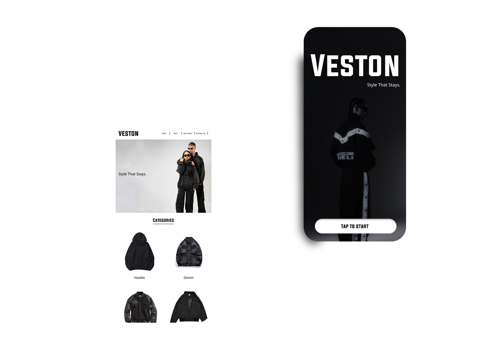
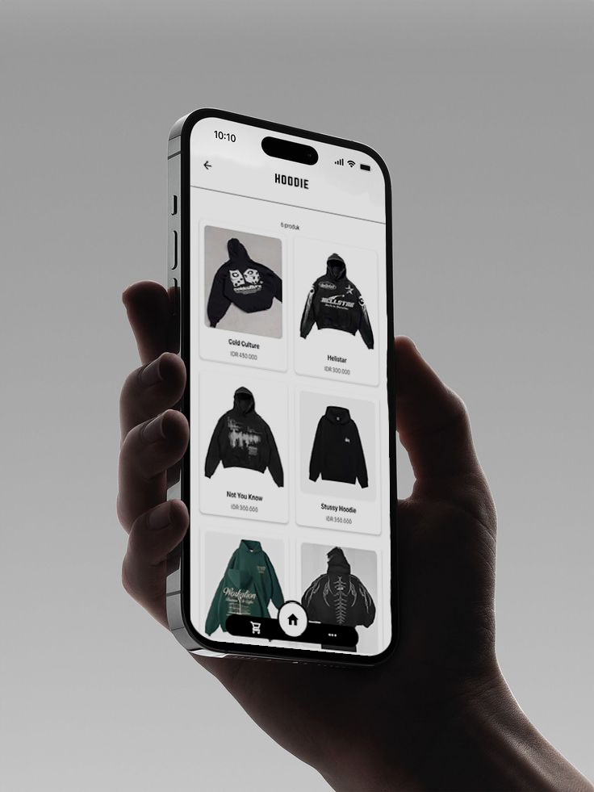

# 🛒 VESTON - E-Commerce Mobile App

<p align="center">
  
</p>

**VESTON** adalah aplikasi e-commerce streetwear modern yang dibangun dengan stack **React Native (Expo)** dan **Node.js**. Aplikasi ini fokus pada pengalaman pengguna yang bersih (*minimalist UI*) dan performa yang optimal untuk kebutuhan belanja masa kini.

> **Status Project:** 🚀 In Development / Portfolio Ready

---

## 📱 Preview UI

Didesain dengan pendekatan minimalis untuk menonjolkan estetika produk.

| Landing Page | Product Listing |
| :---: | :---: |
|  |  |
| *Clean & Bold Entry Point* | *Modern Grid System* |

---

## ✨ Fitur Utama

### 👤 Customer Side
- **Seamless Browsing:** Antarmuka kategori produk yang intuitif dan responsif.
- **Cart Management:** Tambah, hapus, dan kelola item keranjang secara real-time.
- **Secure Checkout:** Alur pemesanan yang sistematis hingga konfirmasi.
- **Authentication:** Sistem Login & Register menggunakan **JWT** (JSON Web Token).

### 🛠️ Admin Dashboard
- **Inventory Control:** Manajemen katalog (Tambah, Edit, Hapus produk).
- **Stock Management:** Pemantauan jumlah stok secara live.
- **Order Tracking:** Rekapitulasi pesanan masuk dari pelanggan.

---

## 🧱 Tech Stack

### Frontend (Mobile)
* **React Native & Expo Go** - Framework utama aplikasi lintas platform.
* **React Navigation** - Navigasi antar layar yang halus.
* **Axios** - Manajemen API request ke server backend.

### Backend & Database
* **Node.js & Express.js** - Server-side logic & RESTful API.
* **JWT** - Standar keamanan autentikasi user.
* **Database:** Kompatibel dengan MongoDB / PostgreSQL / MySQL.

---

## 🚀 Cara Instalasi & Menjalankan

### 1. Clone Repository
```bash
git clone [https://github.com/Eleanore-Py/E-Commerce.git](https://github.com/Eleanore-Py/E-Commerce.git)
cd E-Commerce
```

---

# Masuk ke folder backend (sesuaikan dengan nama folder kamu)
```bash
cd backend
npm install
npm start
```

---

# Masuk ke folder frontend (sesuaikan dengan nama folder kamu)
```bash
cd frontend
npm install
npx expo start
```

---

### 👤 Author
GitHub: @Eleanore-Py

Project: VESTON Streetwear App

<p align="center">Made with ❤️ for Fullstack Mobile Development Study</p>
